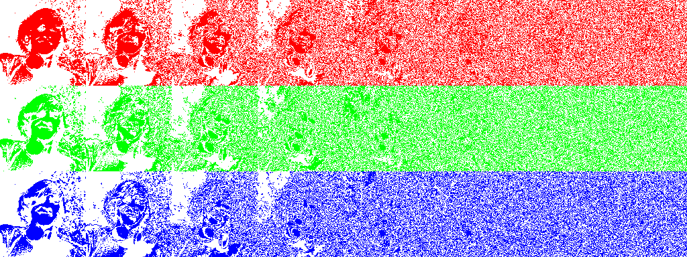

# image-bit-planes

Split an image into bit planes

## Usage

    image-bit-planes [FLAGS] [OPTIONS] <INPUT> <OUTPUT>

## Flags

        --flip-x     Flip the image in the X-axis
        --flip-y     Flip the image in the Y-axis
    -v               Increases the level of debugging information
    -h, --help       Prints help information
    -V, --version    Prints version information

## Options

        --background <BACKGROUND>    Specify the background color [default: 000000]
        --foreground <FOREGROUND>    Specify the foreground color [default: ffffff]

## Args

    <INPUT>     Sets the input file to use
    <OUTPUT>    Sets the output file to use

